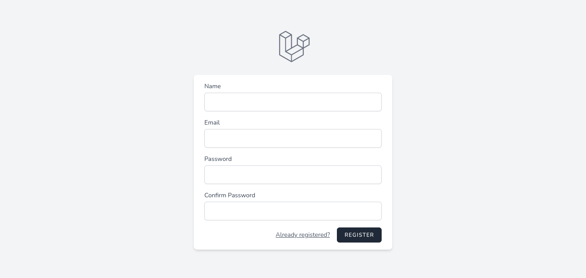
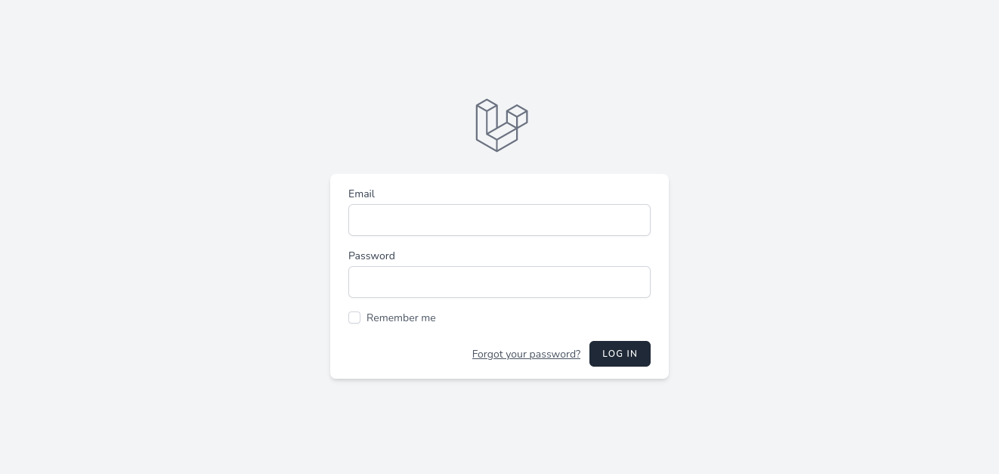
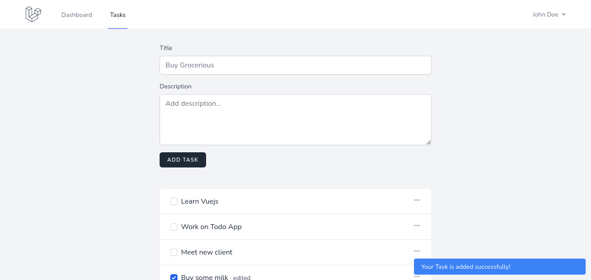
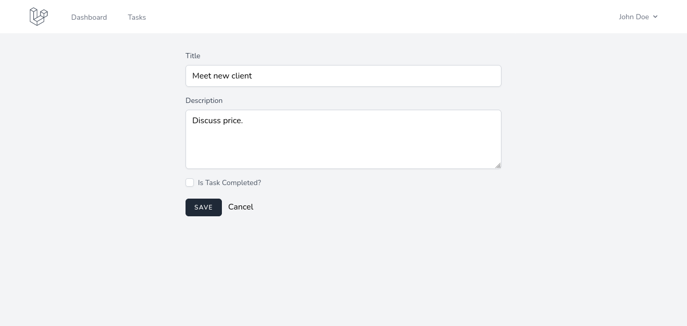
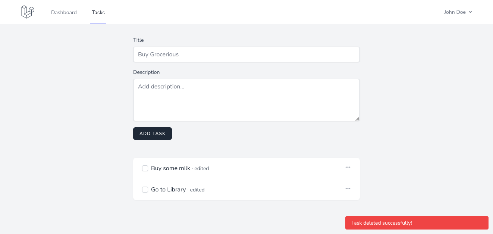

# Laravel Todo Application with user Authentication (+ Breeze)


List of contents:

- [Intro](#intro)
- [Screenshots:](#screenshots)
- [Usage:](#usage)

## Intro

### This is a simple Laravel 9 Todo Application with user authentication (using Laravel Breeze)

### Screenshots







### Usage

1. In your git-enabled terminal, type the following command to clone the repo:

   ```bash
    git clone https://github.com/Inayatullahsh/Laravel_auth_todo
    ```

2. now run the following command to add `.env` file.

   ```bash
   cp .env.example .env
   ```

   >Note: We use `MySQL`; if you'd like to use another _DBMS_, modify the `.env` file.


3. Next, create a database called `laravel_todo`; if you don't like the name, you can change it within the `.env` file.
Change the name of the `DB_DATABASE` and you're good to go.
   ```sql
   -- Execute this command for creating a database in MySQL CLI.
   CREATE DATABASE laravel_todo;
   ```

4. Now, execute the following command to install the necessary Laravel packages:


   ```bash
   composer install
   ```

5. Your project requires a unique key, so execute the following command:


   ```bash
   php artisan key:generate
   ```

6. Laravel is using [Vite](https://laravel.com/docs/9.x/vite) for asset bundling; execute the following command to install the required files.

   Check [Vite](https://laravel.com/docs/9.x/vite) for more info.


   ```bash
   npm install
   ```

7. To create the necessary database tables and populate the database with dummy data, run the following command:


   ```bash
    php artisan migrate --seed
   ```

8. To make the app live, execute the following command:

   ```bash
   php artisan serve
   ```

9.  Final step, Run the following command in another terminal window and navigate to [https://127.0.0.1:8000](https://127.0.0.1:8000), voilà your app is ready.
    ```bash
      npm run dev
    ```
> Note: You can log in with `test@example.com` email and `password` password.

__Happy coding!__

<a href="https://www.buymeacoffee.com/inayatullah">

</a>
